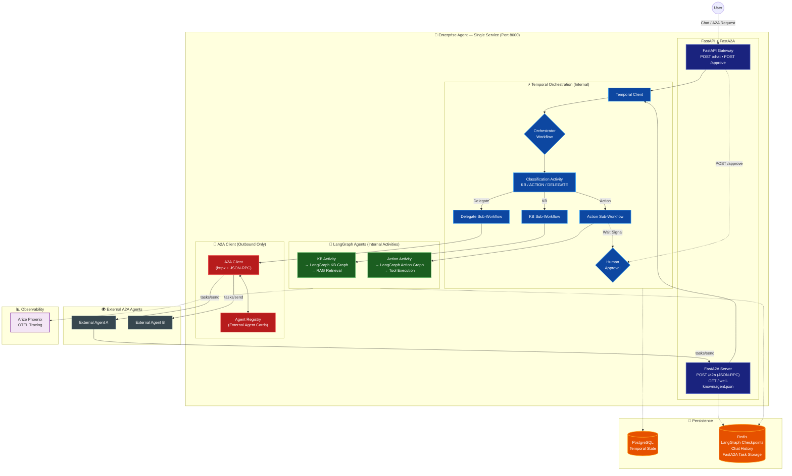

# Enterprise Agent with Temporal + LangGraph + FastA2A

## Goal Description
Build a **single, unified Enterprise Agent** that uses **Temporal** for internal orchestration, **LangGraph** for agentic logic, **FastAPI** as the user-facing gateway, and **FastA2A** to expose the entire system as **one A2A-compliant agent**. 

Internal sub-agents (KB, Action) are **not exposed** — they are internal implementation details invoked by Temporal Activities. The outside world sees **one agent, one Agent Card, one endpoint**.

### Design Principle

```
BEFORE (multiple exposed agents):
  External → KB Agent :8001  (separate A2A server)
  External → Action Agent :8002  (separate A2A server)

AFTER (single unified agent):
  External → Enterprise Agent :8000  (ONE A2A server)
           ↓ (internal only)
           Temporal → KB Activity → LangGraph KB Graph
           Temporal → Action Activity → LangGraph Action Graph
           Temporal → A2A Client → External Agents (delegation)
```

| Concern | How it's handled |
|---|---|
| External identity | **One** Agent Card at `/.well-known/agent.json` |
| External protocol | FastA2A server on single port (8000) |
| Internal routing | Temporal Orchestration Workflow → Classification → Sub-Workflows |
| Internal KB logic | LangGraph KB Graph called as Temporal Activity (in-process) |
| Internal Action logic | LangGraph Action Graph called as Temporal Activity (in-process) |
| External delegation | A2A Client calls external A2A agents |

---

## Architecture

### System Overview



### How It Works

1. **User sends message** → `POST /chat` (human) or `POST /a2a` (another A2A agent).
2. **FastA2A Worker** receives the task and starts a **Temporal Workflow**.
3. **Orchestrator Workflow** → calls **Classification Activity** → returns `KB | ACTION | DELEGATE`.
4. Routes internally:
   - **KB**: Temporal Activity directly invokes LangGraph KB Graph (in-process, no HTTP).
   - **Action**: Temporal Activity invokes LangGraph Action Graph. If sensitive → `input-required` → waits for approval signal.
   - **Delegate**: Temporal Activity uses A2A Client to call an external agent over HTTP.
5. **Result** returned to user via FastAPI response or A2A Task artifact.

---

## Components

### 1. Unified Server (FastAPI + FastA2A — Port 8000)

The single FastAPI app **mounts** the FastA2A ASGI app:

```python
# app/api/server.py
from fastapi import FastAPI
from fasta2a import FastA2A
from app.a2a.worker import TemporalA2AWorker
from app.a2a.storage import RedisStorage

fastapi_app = FastAPI(title="Enterprise Agent")

# --- User-facing routes ---
@fastapi_app.post("/chat")
async def chat(message: str, session_id: str):
    """Start Temporal workflow for user chat."""
    ...

@fastapi_app.post("/approve/{workflow_id}")
async def approve(workflow_id: str):
    """Send approval signal to Temporal workflow."""
    ...

# --- FastA2A (mounted as sub-app) ---
a2a_app = FastA2A(
    storage=RedisStorage(redis_url=REDIS_URL),
    broker=InProcessBroker(),
    worker=TemporalA2AWorker(temporal_client),  # Starts Temporal workflows
    name="enterprise-agent",
    description="Enterprise AI Agent — handles KB queries, actions, and delegations",
    version="1.0.0",
    skills=[
        {"id": "knowledge", "name": "Knowledge Retrieval", "description": "RAG-based Q&A"},
        {"id": "actions", "name": "Action Execution", "description": "Execute enterprise actions with approval"},
        {"id": "delegation", "name": "Task Delegation", "description": "Delegate to specialized external agents"},
    ],
)

fastapi_app.mount("/", a2a_app)  # A2A at root, serves /.well-known/agent.json
```

**Single Agent Card** served at `GET /.well-known/agent.json`:
```json
{
  "name": "enterprise-agent",
  "description": "Enterprise AI Agent — handles KB queries, actions, and delegations",
  "version": "1.0.0",
  "url": "http://enterprise-agent:8000/a2a",
  "capabilities": { "streaming": true, "pushNotifications": false },
  "skills": [
    { "id": "knowledge", "name": "Knowledge Retrieval", "description": "RAG-based Q&A" },
    { "id": "actions", "name": "Action Execution", "description": "Execute enterprise actions" },
    { "id": "delegation", "name": "Task Delegation", "description": "Delegate to external agents" }
  ],
  "authentication": { "schemes": ["bearer"] }
}
```

### 2. FastA2A Worker → Temporal Bridge

The key adapter — connects FastA2A's `Worker` interface to Temporal:

```python
# app/a2a/worker.py
from fasta2a import Worker

class TemporalA2AWorker(Worker):
    """FastA2A Worker that starts Temporal workflows for each A2A task."""

    def __init__(self, temporal_client, storage):
        super().__init__(storage=storage)
        self.temporal_client = temporal_client

    async def run_task(self, params):
        """Called by FastA2A when a task arrives via A2A protocol."""
        message = params.message.parts[0].text
        context_id = params.context_id

        # Start Temporal Orchestration Workflow
        result = await self.temporal_client.execute_workflow(
            "OrchestrationWorkflow",
            args=[message, context_id],
            id=f"a2a-{params.task_id}",
            task_queue="enterprise-agent",
        )
        return result
```

### 3. Temporal Orchestration (Internal)

| Workflow | Role |
|---|---|
| `OrchestrationWorkflow` | Classifies intent, routes to sub-workflows |
| `KBSubWorkflow` | Calls KB Activity (in-process LangGraph) |
| `ActionSubWorkflow` | Calls Action Activity + HITL signal handling |
| `DelegateSubWorkflow` | Calls external A2A agents via A2A Client |

### 4. LangGraph Agents (Internal Activities — Not Exposed)

```python
# app/activities/agent_activities.py
from temporalio import activity
from langgraph.checkpoint.redis import RedisSaver

@activity.defn
async def run_kb_agent(message: str, session_id: str) -> str:
    """Temporal Activity — runs LangGraph KB graph in-process."""
    checkpointer = RedisSaver.from_conn_string(REDIS_URL)
    graph = kb_graph.compile(checkpointer=checkpointer)
    config = {"configurable": {"thread_id": session_id}}
    result = await graph.ainvoke({"messages": [HumanMessage(content=message)]}, config)
    return result["messages"][-1].content

@activity.defn
async def run_action_agent(message: str, session_id: str) -> str:
    """Temporal Activity — runs LangGraph Action graph in-process."""
    checkpointer = RedisSaver.from_conn_string(REDIS_URL)
    graph = action_graph.compile(checkpointer=checkpointer)
    config = {"configurable": {"thread_id": session_id}}
    result = await graph.ainvoke({"messages": [HumanMessage(content=message)]}, config)
    return result["messages"][-1].content
```

> **Key difference**: No separate HTTP services. Both agents are Python functions called directly by Temporal Activities within the same process.

### 5. A2A Client (Outbound Only — For Delegation)
- Only used when the classifier returns `DELEGATE`.
- Calls external A2A-compliant agents over HTTP.
- Not used for internal KB/Action routing.

### 6. Human-in-the-Loop
- Action Sub-Workflow pauses via `workflow.wait_condition`.
- `POST /approve/{workflow_id}` sends Temporal Signal.
- FastA2A task status set to `input-required` while waiting.

### 7. Persistence
- **PostgreSQL**: Temporal workflow state.
- **Redis**: LangGraph checkpoints + chat history + FastA2A task storage.

### 8. Observability
- OTEL trace propagation: `FastAPI/FastA2A → Temporal → LangGraph Activity`.
- Arize Phoenix for LLM tracing and evaluation.

---

## Proposed Changes

### Directory Structure

```
app/
├── api/
│   ├── server.py              # FastAPI + FastA2A unified server (port 8000)
│   ├── routes.py              # /chat and /approve routes
│   └── dependencies.py        # Redis/DB dependencies
├── a2a/
│   ├── worker.py              # TemporalA2AWorker (fasta2a.Worker → Temporal bridge)
│   ├── storage.py             # RedisStorage (fasta2a.Storage subclass)
│   ├── broker.py              # InProcessBroker (fasta2a.Broker subclass)
│   ├── client.py              # A2A Client — outbound calls to external agents
│   └── registry.py            # Agent Registry — external agent discovery
├── workflows/
│   ├── orchestrator.py        # Main Orchestrator Workflow
│   ├── kb_workflow.py         # KB Child Workflow
│   ├── action_workflow.py     # Action Child Workflow (+ HITL)
│   └── delegate_workflow.py   # Delegate to external A2A agents
├── activities/
│   ├── classification.py      # Intent Classification (KB/ACTION/DELEGATE)
│   ├── agent_activities.py    # KB & Action agent activities (in-process LangGraph)
│   ├── a2a_activities.py      # A2A outbound activities (send/get/discover)
│   └── tools.py               # External API tools for Action agent
├── agents/
│   ├── kb_graph.py            # LangGraph KB graph definition
│   ├── action_graph.py        # LangGraph Action graph definition
│   ├── state.py               # Shared Agent State definitions
│   └── checkpoint.py          # Redis Checkpointer setup
├── core/
│   ├── config.py              # All configuration
│   ├── temporal.py            # Temporal Client setup
│   └── logging.py             # Structured logging
├── main.py                    # Temporal Worker entry point
└── docker-compose.yml         # Services: app, temporal, postgres, redis
```

### Key File Details

#### [NEW] `app/api/server.py` — Unified Server
- FastAPI app with `/chat` and `/approve` routes.
- Mounts FastA2A app at root for A2A protocol support.
- Single port 8000. Single Agent Card.

#### [NEW] `app/a2a/worker.py` — Temporal-FastA2A Bridge
- `TemporalA2AWorker(fasta2a.Worker)` — bridges A2A tasks to Temporal workflows.
- `run_task(params)` → starts `OrchestrationWorkflow` via Temporal Client.

#### [NEW] `app/a2a/storage.py` — Redis Storage
- `RedisStorage(fasta2a.Storage)` — persists A2A tasks + context in Redis.

#### [NEW] `app/a2a/broker.py` — In-Process Broker
- `InProcessBroker(fasta2a.Broker)` — simple in-process task scheduling.

#### [NEW] `app/a2a/client.py` — A2A Client (outbound only)
- Used only for `DelegateSubWorkflow` to call external agents.
- `discover()`, `send_task()`, `get_task()`.

#### [NEW] `app/activities/agent_activities.py` — LangGraph Activities
- `run_kb_agent(message, session_id)` — invokes KB graph in-process.
- `run_action_agent(message, session_id)` — invokes Action graph in-process.
- No HTTP calls — direct Python function execution within Temporal Activity.

#### [NEW] `app/agents/kb_graph.py` — KB Graph
- LangGraph graph: RAG retrieval + response generation.

#### [NEW] `app/agents/action_graph.py` — Action Graph
- LangGraph graph: ReAct/Tool-calling agent.

#### [NEW] `docker-compose.yml`
```yaml
services:
  app:              # Single app: FastAPI + FastA2A + Temporal Worker (port 8000)
  temporal:         # Temporal dev server
  postgres:         # PostgreSQL
  redis:            # Redis
```

> Only **4 services** instead of 7. Much simpler deployment.

### Dependencies

```
fasta2a                    # A2A protocol server
httpx                      # A2A client (outbound)
fastapi                    # API gateway
uvicorn                    # ASGI server
temporalio                 # Temporal SDK
langgraph                  # Agent graphs
langgraph-checkpoint-redis # Redis checkpointer
redis                      # Redis client
arize-phoenix              # Observability
```

---

## Verification Plan

### Automated Tests

1. **TemporalA2AWorker Unit Test** — mock Temporal Client, verify A2A task → workflow mapping.
2. **Agent Activities Unit Test** — mock LangGraph graph, test `run_kb_agent` / `run_action_agent`.
3. **A2A Client Test** — mock external agent, test `send_task` / `get_task` roundtrip.
4. **Agent Card Test** — `GET /.well-known/agent.json` → validate single unified card.
5. **E2E Test** — `docker-compose up`, full flow via `POST /chat` and via A2A `tasks/send`.

### Manual Verification

1. `docker-compose up`
2. `curl http://localhost:8000/.well-known/agent.json` → single Enterprise Agent card
3. **KB flow**: `POST /chat {"message": "How do I reset my password?"}` → KB routed internally
4. **Action flow**: `POST /chat {"message": "Submit leave request"}` → Action → HITL → `/approve`
5. **A2A inbound**: External agent calls `POST /a2a` with `tasks/send` → handled exactly like `/chat`
6. **Delegate flow**: Query matched to external agent → A2A Client calls out
7. **Multi-turn**: `context_id` preserved across tasks via Redis
