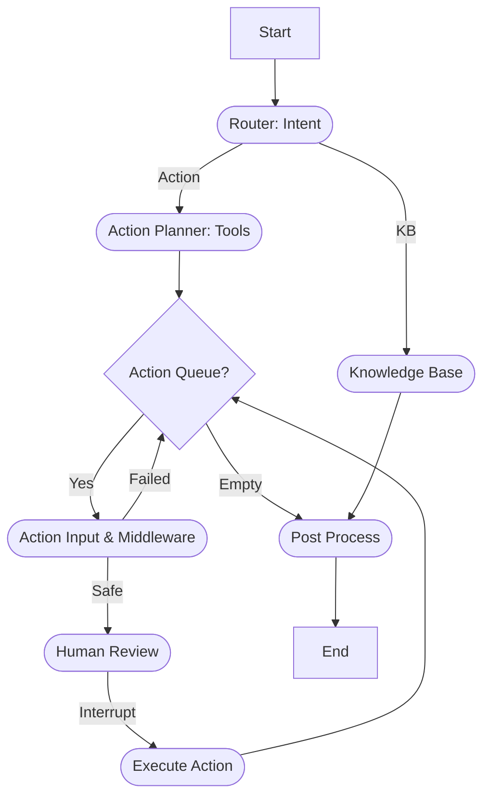

# Technical Documentation: Enterprise LangGraph Agent

## Architecture Overview

The Enterprise Agent is built on **LangGraph**, a stateful orchestration library for LLM agents. It leverages a **ReAct-like** loop with explicit control flow for Human-in-the-Loop (HITL) scenarios.

### System Components

1.  **State Management (`app/core/state.py`)**
    -   Uses a `TypedDict` schema (`AgentState`) to track:
        -   `messages`: Conversation history.
        -   `user_info`: User context (ID, Role).
        -   `access_token`: Bearer token for API calls.
        -   `action_queue`: Pending actions for multi-step tasks.
        -   `middleware_results`: Security check outcomes (RAI, PII).
        -   `dialog_context`: Persistent context for the current session.
    -   **Persistence**: Uses `RedisSaver` to checkpoint state after every node transition, allowing resumption after server restarts or human interruptions.

2.  **Router Node (`app/agent/graph.py`)**
    -   **Model**: Configurable via `ACTION_LLM_MODEL`.
    -   **Logic**: Simple classification: Is this a question (`kb`) or a task (`action`)?
    -   **Output**: Routes to `kb_node` or `action_planner_node`.

3.  **Action Planner Node (`app/agent/graph.py`)**
    -   **Model**: Uses `ACTION_LLM_MODEL` with **Tool Bindings** (`bind_tools`).
    -   **Logic**: Analyzes the request and available tools to generate a list of actions.
    -   **Output**: Populates `action_queue` in state.

4.  **Action Loop & Dispatcher**
    -   **Dispatcher**: Acts as a traffic controller. It checks the `action_queue`.
        -   If Queue is NOT empty: Pops the next action → `Action Input` node.
        -   If Queue is empty: Routes to `Post Process` node.
    -   **Loop**: `Execute Action` node edges back to `Dispatcher`, creating a loop until all actions are consumed.

5.  **Middleware & Security (`app/services/middleware.py`)**
    -   **RAI Check**: Scans input for policy violations (Mock: blocks "unsafe").
    -   **PII Filter**: Redacts regex-matched sensitive info (Emails, Phones) *before* processing action data.
    -   **Permissions**: Validates `user_info.role` against the requested action.
    -   **Token Validation**: Decodes `access_token` to retrieve user identity.

6.  **Human-in-the-Loop (HITL)**
    -   **Mechanism**: Uses LangGraph's `interrupt_before=["execute_action_node"]`.
    -   **Flow**:
        1.  Router detects action.
        2.  Graph pauses *before* execution.
        3.  Server returns `status: interrupted`.
        4.  User calls `/approve` API.
        5.  Server resumes graph with `None` input.
        6.  Action executes.

## Data Flow Diagram



## API Reference

### `POST /chat`
Initiates or continues a conversation.

**Request**:
```json
{
    "message": "string",
    "thread_id": "string (optional, auto-generated if missing)",
    "access_token": "string (optional)",
    "user_id": "string"
}
```

**Response**:
```json
{
    "response": "string",
    "status": "completed | interrupted",
    "thread_id": "string (returned for continuation)"
}
```

### `POST /approve`
Resumes an interrupted workflow.

**Request**:
```json
{
    "thread_id": "string",
    "approved": boolean
}
```

## Redis Integration
-   **Key Schema**: LangGraph manages keys internally using the `thread_id`.
-   **Serialization**: Uses `pickle` (via LangGraph default) or JSON if configured, to store the state snapshot.
